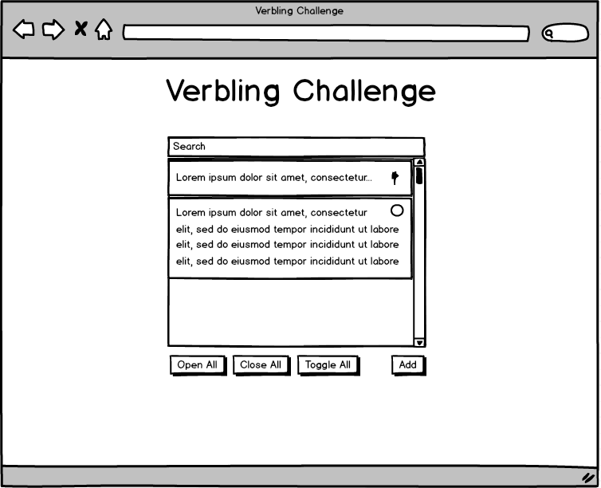

# Verbling React Challenge

### Requirements

Create a simple scrollable/searchable list where list items can be expanded and collapsed.

- Item area should be scrollable with a fixed width of 200px and a height of 200px.
- UI Should include an "Add" button that prompts user for input (can use `window.prompt`) and adds a new list item to the top of the list.
- List items should have a height of 50px when closed, and a variable height that fits to item content when expanded.
- When a list item is closed, the contained text should be truncated with an ellipsis. (ex: Truncat...)
- The search bar should suggest a filtered subset of the available list items that have text that matches the search string in either the title or the item body.
- List items should be clickable, toggling a list item's expanded/collapsed state.
- UI should include an "Expand all" button should expand all list items
- UI should include a "Collapse all" button should collapse all list items
- UI should include a "Toggle all" button should toggle the expanded/collapsed state of all items.
- Data and View layers should be organized and efficiently structured to meet the needs of the app

### Submission Instructions

- Fork this repository to your github account and push your changes accordingly - this is where we'll view your submission.
- Fulfill requirements by modifying files with your code in `client/`.
- Comments are encouraged but don't overdo it– effective, simple code speaks for itself.
- Feel free to use any packages or libraries that help you complete these tasks, just make sure they're installed via `npm install` and saved to your `package.json`. (If you do not have node installed, we suggest installing [Homebrew](http://brew.sh/) and then running `brew install node`)
- You don't need to run a server, but if you would like to, we have provided a simple one for you. Run the server by running `npm install && npm start` in the `server/` directory. You should then be able to access the server at `localhost:3000`
- Please place styles in `styles.css` as it is referenced in `index.html`.
- To build the Javascript bundle, use `webpack`. (use `webpack --watch` to watch files for re-bundle on file change).
- When you are done, please contact us with a link to your forked repo, preferably on GitHub.
- Please do not copy or plagiarize other submissions, it's easy to spot.

### Criteria

- Must use React. We use ES6 features at Verbling, but you are free not to.
- Must fulfill the requirements listed above
- Keep as elegant code as possible

**Elegance** here is not a subjective criteria. Let's define code elegance to be "*the ability of a programmer to easily understand the program's flow and state coordination, being completely familiar with the tools used but completely unfamiliar with the codebase*". Special attention is given to "familiar with the tools" and "unfamiliar with the codebase". This means if I know nothing about ClojureScript, a ClojureScript solution to this problem might still be very elegant to an experienced ClojureScript developer. On the other hand, unfamiliarity with the codebase is important to determine that, because usually as you grow familiar with a codebase, you find it easier to understand how it works. **Our objective is to make it easy for a peer programmer to join a codebase and quickly understand how it works.**
